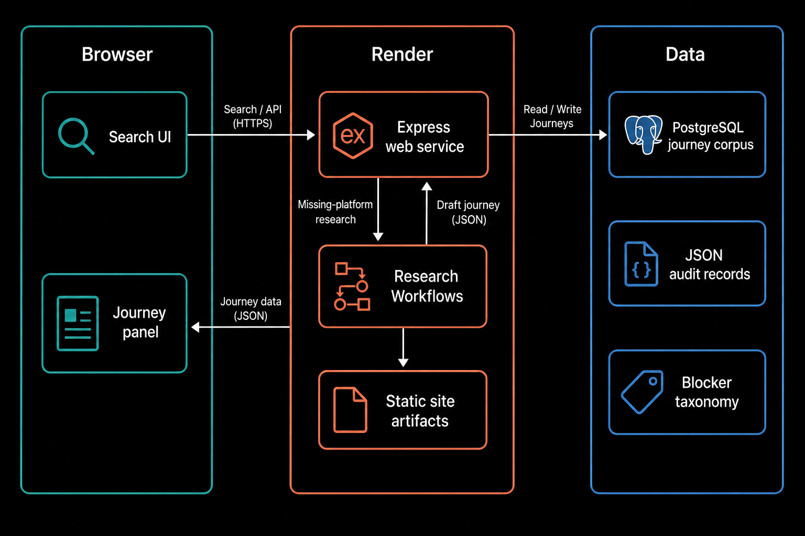
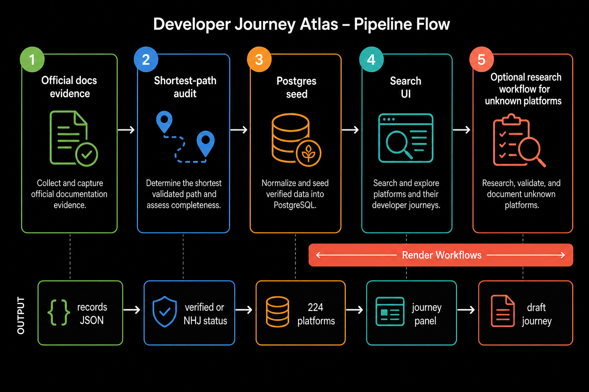

# Developer Journey Atlas

Search a developer platform and inspect its documented route from account creation to first success.

[Live Atlas](https://developer-journey-atlas.onrender.com) · [Deploy to Render](https://render.com/deploy?repo=https://github.com/ojusave/developer-journey-atlas) · [Data manifest](https://developer-journey-atlas.onrender.com/data/index.json) · [LLM guide](https://developer-journey-atlas.onrender.com/llms.txt)





## Highlights

- **224 platforms** with preserved official-documentation evidence records and shortest-path audits.
- **Audit-status honesty**: only verified audits expose action counts or peer context; unresolved routes show the evidence gap.
- **Postgres-backed serving** on Render for journeys, curves, and blocker hypotheses (790 hypotheses, not observed drop-off causes).
- **Optional research workflows** for missing platforms: search official docs, assemble a schema-valid draft, and show it in-session.
- **Anonymous peer context** when a subject and enough same-category verified peers share a comparable first-success type.

## Overview

Developer Journey Atlas is a public research wrapper over a corpus of platform onboarding paths. Each path starts at account creation, lists required developer actions and fields, and stops at a defined first-success outcome. Source records stay readable JSON. Audits sit beside them. Friction gates and blocker taxonomy entries are hypotheses until observed journey evidence says otherwise.

This is route structure, not conversion, activation, usability, or completion-time data.

## Table of contents

- [Usage](#usage)
- [Deploy](#deploy)
- [Configuration](#configuration)
- [Project structure](#project-structure)
- [License](#license)

## Usage

Open the [live Atlas](https://developer-journey-atlas.onrender.com), search for a platform (for example `Render` or `Plaid`), and read the journey panel: audit status, required actions and fields, waits, external gates, exclusions, and sources.

API sketch (same host):

```http
GET /api/meta
GET /api/platforms?q=render
GET /healthz
```

`/healthz` reports `dataStore=postgres` when the Render Postgres read model is active.

## Deploy

Deploy with the Blueprint at `render.yaml` (web service + Postgres). Prefer the Deploy button above, or create from the Render Dashboard with this repository.

The Blueprint uses a starter web plan and `preDeployCommand` for `db:setup` (migrate + seed). Workflow services for live research are created separately with the Render CLI or Dashboard; they are not Blueprint-managed yet.

## Configuration

| Variable | Required | Notes |
| --- | --- | --- |
| `DATABASE_URL` | Yes (Postgres mode) | Wired from Render Postgres via Blueprint `fromDatabase` |
| `DATA_STORE` | Yes | `postgres` in production |
| `NODE_VERSION` | Yes | `22.22.0` |
| `PORT` | Set by Render | Bind `0.0.0.0:$PORT` |
| `OPENROUTER_API_KEY` | Optional | Research / blocker linking |
| `OPENROUTER_MODEL` | Optional | Research model id |
| `RENDER_API_KEY` | Optional | Start/read Workflow runs from the web service |
| `RENDER_WORKFLOW_TASK_SLUG` | Optional | Default research task slug |
| `RENDER_VERIFY_TASK_SLUG` | Optional | Default verify task slug |
| `BLOCKER_LINKING_ENABLED` | Optional | `"true"` to enable linking |

Health: `GET /healthz`. Logs: Render service logs for the web service and any Workflow service.

## Project structure

| Path | Purpose |
| --- | --- |
| `packages/journey-corpus/` | Evidence records, audits, Express app, Prisma seed, public web UI |
| `packages/blocker-taxonomy/` | Blocker hypothesis inventory (`first-mile-blocker-universe.txt`) |
| `packages/generated-views/` | Deterministic JSONL projections for humans/LLMs |
| `workflows/` | Render Workflows package for research/verify tasks |
| `render.yaml` | Web service + Postgres Blueprint |
| `static/images/` | README architecture and pipeline diagrams |

Corpus contracts used at build time live as plain text: `SELECTION-POLICY.txt` and `MEASUREMENT-CONTRACT.txt` under `packages/journey-corpus/`. The only Markdown file in the repository is this README.

## License

Software is Apache-2.0 (`LICENSE`). Original research expression is Creative Commons Attribution 4.0 (`DATA_LICENSE.txt`). Path boundaries: `LICENSE_SCOPE.txt`.
